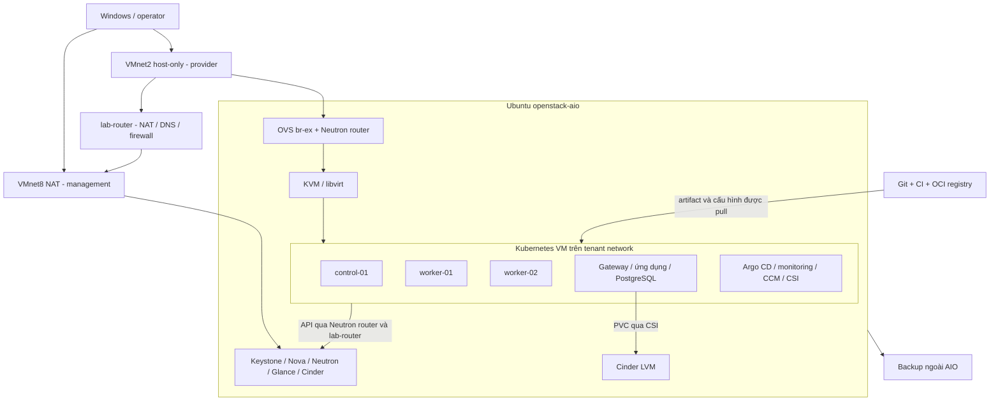

# OpenStack – Kubernetes Lab: Kế hoạch triển khai và vận hành

**Phiên bản:** 2.0  
**Ngày cập nhật:** 03/10/2026  
**Nền tảng:** VMware Workstation → Ubuntu Server → Kolla-Ansible/OpenStack → Kubernetes  
**Trạng thái tài liệu:** Kế hoạch thực hiện; chưa phải báo cáo nghiệm thu hệ thống.  
**Giả định phần cứng:** Theo bản gốc: Windows, CPU Intel, RAM khoảng 16 GB. Cần xác nhận tại P0.

Bản kế hoạch này hướng tới một private cloud lab có thể dựng lại, triển khai ứng dụng, theo dõi, xử lý lỗi và khôi phục dữ liệu. Mục tiêu hoàn chỉnh gồm OpenStack AIO, Kubernetes trên VM OpenStack, IaC, GitOps, bảo mật cơ bản, backup và diễn tập vận hành.

Bản v1 được lưu nguyên trạng tại [tài liệu gốc](docs/archive/OpenStack-Cloud-Native-Lab-Architecture-Requirements.v1.md). Các dấu hoàn thành trong bản gốc là thông tin đã được ghi nhận trước đây; cần bổ sung bằng chứng trước khi xác nhận đạt trong kế hoạch mới.

## 1. Cách sử dụng kế hoạch

1. Thực hiện lần lượt P0 → P9 trong bảng roadmap. Mỗi phase có đầu vào, việc làm, đầu ra và điều kiện qua cổng.
2. Bắt đầu bằng kiểm kê hệ thống đang có. Giữ cấu hình hoạt động, đối chiếu sai khác trước khi thay đổi.
3. Lưu cấu hình có thể tái tạo vào Git; lưu bí mật và backup trong kho riêng có mã hóa.
4. Chỉ đánh dấu `PASS` khi có kết quả chạy thực tế, thời gian, phiên bản và đường dẫn bằng chứng.
5. Nếu thiếu RAM hoặc phụ thuộc chưa đạt, ghi `BLOCKED` cùng lý do; phần chưa thực hiện ghi `NOT_RUN`.

| Mức hoàn thành | Phạm vi phải đạt | Kết quả có thể công bố |
|---|---|---|
| Foundation | P0–P2 | Private cloud AIO có IaC, compute/network/storage hoạt động |
| Integrated lab | P0–P6 | Kubernetes chạy trên OpenStack, lưu trữ Cinder, ứng dụng qua GitOps |
| Operational lab | P0–P9 | Lab đầy đủ theo kế hoạch: đo đạc, phục hồi, nâng cấp và dựng lại |
| HA extension | Mục 21 | Khả năng chịu lỗi được xác nhận theo từng miền lỗi đã thử |

Một AIO, một Kubernetes control plane, một ổ Cinder LVM và một máy vật lý đều là điểm lỗi đơn. Operational lab vẫn có giá trị thực hành đầy đủ, nhưng phạm vi nghiệm thu không bao gồm HA hạ tầng.

## 2. Phạm vi công nghệ và lựa chọn mặc định

| Lớp | Lựa chọn cho tuyến triển khai chính | Mục đích |
|---|---|---|
| Virtualization | VMware Workstation, nested VT-x/EPT, KVM | Chạy Nova VM có tăng tốc phần cứng |
| OpenStack | Kolla-Ansible AIO, Ubuntu Server 24.04 | Private cloud có thể tái tạo |
| Cloud services | Keystone, Nova, Placement, Glance, Neutron ML2/OVS, Cinder LVM, Horizon | Compute, mạng, storage, API |
| Dịch vụ nền | MariaDB, RabbitMQ, HAProxy, Keepalived; ProxySQL nếu release bật | Phụ thuộc điều khiển cloud |
| Mạng lab | VMnet8 NAT + VMnet2 host-only + một VM router ngoài AIO | Internet cho tenant và đường tới API |
| IaC | Terraform OpenStack provider | VM, port, security group và tài nguyên tenant |
| Cấu hình | Ansible + cloud-init tối thiểu | OS, containerd, kubeadm, bootstrap |
| Kubernetes | 1 control plane + 2 workers | Lịch chạy workload, rolling update, worker recovery |
| CNI | Calico VXLAN, kube-proxy | Pod networking và NetworkPolicy |
| Tích hợp cloud | External OpenStack CCM + Cinder CSI | Nhận diện node, cấp persistent volume |
| HTTP/TLS | Gateway API + Envoy Gateway, NodePort ở baseline | Truy cập ứng dụng không phụ thuộc Octavia |
| Delivery | Helm + Argo CD + CI + OCI registry | Build, kiểm tra, phát hành theo Git |
| Quan sát | Prometheus, Grafana, Alertmanager; log tập trung theo tài nguyên | Phát hiện và chẩn đoán lỗi |
| Recovery | Backup cấu hình, MariaDB, etcd, dữ liệu ứng dụng và volume | Khôi phục có kiểm chứng |

Heat là bài tập tùy chọn; nếu đã cài thì ghi lại trạng thái và mức dùng tài nguyên. Octavia, Ceph, Magnum, Manila, service mesh, tracing và multi-cluster thuộc phần mở rộng. Mỗi thành phần bổ sung phải có use case, ngân sách tài nguyên và bài nghiệm thu riêng.

## 3. Ngân sách tài nguyên và giới hạn khả thi

### 3.1. Phân biệt RAM máy vật lý, AIO và VM bên trong

RAM của Kubernetes VM nằm **bên trong phần RAM cấp cho AIO**. Ví dụ AIO 24 GiB phải chứa đồng thời dịch vụ OpenStack, QEMU và mọi VM Kubernetes. Nova cho phép overcommit không có nghĩa là máy vật lý có thêm RAM.

Các số sau là **ước lượng thiết kế ban đầu**, cần đo ở P0/P1; không phải cấu hình tối thiểu được bảo đảm bởi tất cả dự án.

| Profile | RAM máy vật lý | RAM AIO | Kubernetes VM | Phạm vi thực hiện |
|---|---:|---:|---|---|
| F – máy hiện tại | ~16 GB | 8–10 GiB | Chỉ VM smoke nhỏ, chạy từng bài | P0–P2; chưa cam kết chạy trọn platform |
| C – tích hợp gọn | 32 GiB | Khoảng 22 GiB | CP 2 GiB + 2 worker × 3 GiB = 8 GiB | P0–P9 với tải nhẹ, phải đo và cắt retention/replica phụ trợ |
| R – thực hành thuận tiện | 64 GiB | Khoảng 44 GiB | CP 4 GiB + 2 worker × 6 GiB = 16 GiB | Có dư địa cho monitoring, backup/restore và nâng cấp |

Profile C: dự trù 10 GiB dịch vụ OpenStack/OS + 8 GiB guest + 4 GiB overhead/dự phòng trong AIO; còn khoảng 10 GiB ngoài AIO cho Windows, VMware, router, operator. Profile R: dự trù 12 GiB OpenStack/OS + 16 GiB guest + 16 GiB overhead/dự phòng. Kiểm tra số đo trước khi tăng workload.

- Giữ cấu hình AIO hiện tại 6 vCPU ở profile F. Profile C/R bắt đầu khoảng 8/12 vCPU nếu CPU vật lý đáp ứng; tránh cấp vCPU vượt khả năng host rồi coi đó là năng lực thật.
- Mỗi Kubernetes VM bắt đầu 2 vCPU. Ghi số core/thread vật lý, CPU steal, tải host và thời gian pull image.
- Router ngoài AIO: 1 vCPU, 512 MiB–1 GiB RAM, 8–12 GiB disk; tính thêm ngân sách operator/runner nếu chạy VM riêng.
- Profile F có thể thực hành Kubernetes riêng khi tắt AIO; kết quả đó ghi là bài học độc lập, chưa đạt tích hợp Kubernetes-on-OpenStack.
- Không dùng swap hay tăng RAM allocation ratio để hợp thức hóa thiếu bộ nhớ. Đặt quota guest và RAM reservation của Nova theo phần dành cho OpenStack; dùng RAM allocation ratio 1.0 làm điểm xuất phát cho lab này.
- Trước drain/worker failure drill, tính tổng requests so với allocatable của các worker còn lại. Profile C không mặc nhiên có capacity N+1; giảm tải được phép hoặc bổ sung tài nguyên trước bài thử, ghi lại ảnh hưởng tới addon và ứng dụng.

### 3.2. Disk và dung lượng thực

| Vùng lưu trữ | Hiện tại theo v1 | Mục tiêu C/R để lập ngân sách |
|---|---|---|
| AIO OS, container, log, Glance, Nova ephemeral | 90 GB | 180–250 GiB tùy image/cache/VM root disk |
| Disk riêng cho Cinder LVM | 50 GB | 100–150 GiB, theo dữ liệu và bài snapshot/restore |
| Root disk của 3 VM Kubernetes | Chưa có | CP 25–30 GiB; worker 30–40 GiB/node, thuộc vùng Nova nếu dùng ephemeral root |
| Backup | Chưa xác định | Đích ngoài AIO; dự trù ít nhất một bản full và dung lượng restore tạm |

Dung lượng virtual disk không bằng SSD vật lý còn trống. Lập bảng cộng OS, image cache, VM disk, Cinder, snapshot và bản sao phục hồi; giữ khoảng 20% dung lượng vật lý trống. Thin provisioning vẫn có thể làm đầy ổ host. Ổ backup nằm cùng SSD vật lý chỉ giúp phục hồi lỗi VM, chưa bảo vệ khỏi hỏng SSD.

## 4. Kiến trúc mục tiêu



Đây là sơ đồ logic. Cinder CSI gọi API để cấp/attach disk; đường dữ liệu đi qua Cinder backend → Nova/libvirt → block device trong worker → filesystem/PVC. Không đưa traffic iSCSI của hypervisor qua Pod network.

## 5. Phiên bản, khả năng tương thích và vòng đời

Trước triển khai phải tạo `docs/versions.md` với phiên bản thực tế, nguồn tải, checksum/digest, ngày chốt và lịch cập nhật. Thông tin sau là hướng lựa chọn tại ngày sửa tài liệu, chưa phải danh sách đã cài.

| Thành phần | Quyết định tại P0 |
|---|---|
| Windows / VMware | Ghi edition/build, bản VMware và tình trạng hỗ trợ; xác nhận nested virtualization hoạt động với cấu hình Hyper-V/VBS hiện có |
| Ubuntu AIO | 24.04 LTS; ghi kernel và patch level |
| OpenStack đang chạy | Lấy từ package Kolla, config và container image; không suy ra từ bản Ubuntu |
| Dựng AIO mới | Dùng series Kolla/OpenStack 2026.1 làm ứng viên đã có tài liệu hỗ trợ Ubuntu 24.04; chốt patch/commit và image tương ứng |
| Ansible / Python / Docker | Theo requirements của đúng Kolla release; pin môi trường venv và lưu dependency inventory |
| Kubernetes mới | Ưu tiên minor 1.36 nếu ma trận của tất cả addon đã chọn cho phép; pin patch cụ thể, không dùng `latest` |
| CCM / Cinder CSI | Chọn release tương ứng Kubernetes minor, kiểm tra sidecar/chart compatibility |
| Calico | Pin một stable release hỗ trợ Kubernetes đã chọn; xác nhận kernel/dataplane trước khi cài |
| Envoy Gateway / Gateway API | Ma trận hiện tại có Envoy Gateway 1.9 hỗ trợ Kubernetes 1.36; pin patch và CRD version phù hợp |
| containerd / runc | Phiên bản tương thích Kubernetes; CRI hoạt động, cgroup driver nhất quán |
| Terraform/provider, Helm, Argo CD, monitoring | Pin CLI/provider/chart/image; commit lockfile; ghi yêu cầu Kubernetes API |
| Cloud image | Ubuntu cloud image có cloud-init; lưu URL, ngày build, checksum; CirrOS chỉ dùng smoke |

Khi dùng lại cloud hiện có, giữ nguyên series đã nhận diện để hoàn thiện bằng chứng; nâng cấp là một thay đổi riêng tại P9. Không đổi `openstack_release` để trộn Kolla và image của các series khác nhau. Lưu digest và cách giữ bản image cần để dựng lại; một branch/tag có thể thay đổi theo thời gian.

Nguồn: [Kolla support matrix](https://docs.openstack.org/kolla-ansible/2026.1/user/support-matrix.html), [Operating Kolla](https://docs.openstack.org/kolla-ansible/2026.1/user/operating-kolla.html), [Kubernetes releases](https://kubernetes.io/releases/), [Envoy Gateway matrix](https://gateway.envoyproxy.io/news/releases/matrix/), [Calico requirements](https://docs.tigera.io/calico/latest/getting-started/kubernetes/requirements).

## 6. Thiết kế mạng có đường đi đầy đủ

### 6.1. IP plan

Giữ các dải mạng của v1 nếu không trùng LAN, VPN, WSL/Docker và mạng đang sử dụng. Mọi IP dưới đây là địa chỉ thiết kế cần kiểm tra xung đột trước khi gán.

| Mạng/thành phần | Địa chỉ dự kiến | Quy tắc |
|---|---|---|
| Management – VMnet8 NAT | `192.168.17.0/24` | AIO và router dùng để ra Internet |
| Windows VMnet8 | `192.168.17.1` | Đây là IP host; không mặc định là NAT gateway |
| AIO `ens33` | `192.168.17.20/24` | IP tĩnh, default route qua NAT gateway thực của VMnet8 |
| Kolla VIP | `192.168.17.10` | Để trống, ngoài DHCP pool; Keepalived quản lý |
| lab-router WAN | `192.168.17.30/24` | Ngoài DHCP pool; default route qua NAT gateway thực |
| Provider – VMnet2 host-only | `172.20.0.0/24` | VMware DHCP tắt |
| Windows VMnet2 | `172.20.0.1` | Operator truy cập Floating IP |
| lab-router LAN | `172.20.0.254/24` | Gateway thật của provider subnet; DNS forwarder của lab |
| AIO `ens34` | Không gán IPv4 | OVS sử dụng qua `br-ex`, nối VMnet2 |
| Provider allocation pool | `172.20.0.100–172.20.0.199` | Dùng cho external router ports và Floating IP; không dành toàn bộ cho FIP |
| Tenant network `private` | `10.10.10.0/24` | Gateway Neutron `10.10.10.1`, DHCP bật |
| Kubernetes node ports | CP `.10`, workers `.21`, `.22` trong tenant subnet | Terraform quản lý Neutron fixed IP; DHCP pool có thể đặt `.50–.199` |
| Kubernetes Pod CIDR | `10.244.0.0/16` | Chốt cả kubeadm và Calico theo cùng giá trị |
| Kubernetes Service CIDR | `10.96.0.0/12` | Không chồng lấn tenant, management, VPN hoặc Pod CIDR |
| Tên lab | `cloud.lab.test`, `api.k8s.lab.test`, `app.lab.test` | DNS/hosts do mình quản lý; dùng CA nội bộ |

Tên NIC chỉ là ví dụ từ v1. Kiểm tra `ip -br link` và MAC VMware trước khi viết Netplan/Kolla. Không gán VIP vào Netplan, không đặt default gateway trên `ens34`, không giả định VMnet8 NAT gateway là `.1` hoặc `.2`.

### 6.2. Egress cho tenant: hạng mục bắt buộc trước Kubernetes

Tạo VM `lab-router` trực tiếp trên VMware, nằm **ngoài AIO**, có một NIC VMnet8 và một NIC VMnet2. Bật IPv4 forwarding, cấu hình nftables persist qua reboot, NAT nguồn traffic LAN khi đi WAN, chỉ cho phép forward theo policy của lab.

```text
VM/Pod → tenant gateway 10.10.10.1 → Neutron SNAT
       → external router port 172.20.0.x → lab-router 172.20.0.254
       → SNAT sang 192.168.17.30 → VMware NAT → Internet
```

- Provider network: external, flat, `physnet1`, subnet gateway `172.20.0.254`, DHCP tắt.
- Router Neutron `router1`: external gateway là network `public`; internal interface nối `private-subnet`.
- Cấu hình DNS forwarder trên router, chỉ listen trên mạng lab; cấp DNS `172.20.0.254` qua Neutron DHCP.
- Allow established/related, DNS TCP/UDP 53 tới resolver, NTP UDP 123 tới nguồn thời gian và HTTP/HTTPS theo repository/registry thực dùng. Mặc định chặn các luồng forward không được khai báo.
- Router cho phép tenant tới các API cần thiết trên Kolla VIP; chặn tenant tới MariaDB, RabbitMQ, SSH quản trị và các địa chỉ management khác.
- Lưu routes, sysctl, DNS và nftables trong cấu hình có thể tái tạo. Kiểm tra lại egress sau reboot router/AIO.

Host-only VMnet2 tự nó không có Internet. Truy cập được Floating IP từ Windows chỉ chứng minh đường inbound trong lab. Nếu không thêm router, phải thiết kế một đường egress khác và cập nhật toàn bộ IP/route/firewall plan trước P3.

### 6.3. Đường tới OpenStack API, metadata và Kubernetes API

CCM và CSI cần kết nối Keystone cùng các endpoint trong service catalog. Với thiết kế này: node/Pod → Neutron router → lab-router → Kolla VIP. lab-router SNAT để traffic trả về đúng đường; kiểm tra từ cả VM node và Pod, bao gồm DNS và CA trust.

- `cloud.lab.test` phân giải về `192.168.17.10`; certificate có SAN đúng hostname; client sử dụng CA đã tin cậy.
- Lấy port thực từ `openstack endpoint list`. Các API có thể dùng port riêng như 5000/8774/8776/9696; không mặc định mọi endpoint đều ở 443.
- Metadata `169.254.169.254` do Neutron metadata path cung cấp; kiểm tra cloud-init và instance identity từ VM. Không biến lab-router thành metadata server.
- `api.k8s.lab.test`: trong node cluster phân giải về CP fixed IP `10.10.10.10`; trên operator phân giải về FIP của CP. Dùng split DNS hoặc hosts được quản lý rõ ràng.
- kubeadm dùng `controlPlaneEndpoint: api.k8s.lab.test:6443`, advertise address là fixed IP; certificate SAN gồm các tên/IP thực dùng. Cluster join qua tenant network.
- Terraform cấp FIP và xuất mapping; chỉ cập nhật DNS/hosts sau khi có địa chỉ thật. Một CP và một FIP không tạo ra failover endpoint.

### 6.4. MTU, Neutron port security và policy

Calico chạy VXLAN trong VM, còn Neutron tenant có thể chạy VXLAN bên ngoài. Nếu guest NIC MTU 1450, Calico VXLAN IPv4 thường cần Pod MTU 1400. Đây là ví dụ; đo MTU thực tế và tính theo encapsulation đang bật. Kiểm tra packet lớn với DF, DNS, HTTPS upload/download và Pod-to-Pod khác node; ping nhỏ thành công chưa đủ. [Calico MTU](https://docs.tigera.io/calico/latest/networking/configuring/mtu).

Giữ Neutron port security; Calico VXLAN dùng địa chỉ node làm lớp ngoài. Đặt `natOutgoing` phù hợp để Pod ra ngoài qua node IP. Chỉ thay allowed-address-pairs khi có thiết kế VIP/routed Pod cụ thể; không tắt anti-spoofing cho toàn cluster để chữa lỗi mạng.

### 6.5. Ma trận truy cập tối thiểu

| Nguồn → đích | Port/protocol | Điều kiện |
|---|---|---|
| Operator → AIO/router | TCP 22 | IP quản trị cụ thể |
| Operator → Kolla VIP | Các port HTTPS/API trong catalog | Đúng endpoint và CA |
| Operator → node FIP | TCP 22, ICMP có kiểm soát | Security group riêng, không sửa default group thành mở rộng |
| Operator + nodes → CP | TCP 6443 | Nodes qua fixed IP; operator qua FIP |
| CP → kubelet các node | TCP 10250 | Chỉ nguồn CP/SG control plane |
| metrics-server → kubelet | TCP 10250 | Mở từ nguồn node/Pod thực tế theo CNI; TLS kubelet hợp lệ |
| Node → node | UDP 4789 | Calico VXLAN; rule giữa các SG node liên quan |
| Pod → API/DNS/workload | Theo NetworkPolicy | Default deny ở namespace ứng dụng; allow từng phụ thuộc |
| CCM/CSI → OpenStack | API catalog qua router | Đúng scope project và CA |
| Operator → worker FIP | TCP NodePort HTTP/TLS đã chốt | Chỉ các port đang dùng, ví dụ 30080/30443 nếu chart cấu hình được |
| Monitoring → exporter | Port thực trong cấu hình scrape | Chỉ nguồn monitoring |
| Nova/storage → iSCSI | TCP 3260 khi backend dùng iSCSI | Phạm vi hypervisor/storage; không mở cho tenant |

Nếu Calico bật thêm Typha hoặc thành phần khác, bổ sung port từ manifest release đã pin. Baseline tắt BGP/IP-in-IP không sử dụng. etcd 2379/2380 chỉ dành cho control plane; mở rộng peer rules khi thực hiện HA. Luôn làm negative test từ nguồn không được phép.

## 7. Identity, bí mật và phân quyền

- Tạo project `lab-platform` cho Terraform và Kubernetes; project `lab-isolation` để thử cô lập tenant.
- Admin chỉ dùng cho bootstrap cloud: image, flavor, external network, quota, role và policy. Terraform tenant dùng account/application credential giới hạn project.
- Tách credential Terraform, CCM, CSI và backup; đặt thời hạn/rotation, quyền tối thiểu theo operation thực dùng. Ghi rõ policy bổ sung nếu mặc định cloud không đủ quyền.
- Dùng `clouds.yaml` riêng trên operator và CA file; chọn cloud profile `lab-platform`. Không chạy pipeline tenant bằng `kolla-admin`.
- `passwords.yml`, private key, kubeconfig admin, cloud config, app credential, Terraform state/plan và bản dump đều là dữ liệu nhạy cảm.
- Kubernetes Secret dạng base64 chưa có mã hóa nội dung. Secret GitOps phải được mã hóa, ví dụ SOPS/age với cơ chế giải mã Argo CD đã cấu hình; lưu recovery key ngoài cluster. Cấu hình encryption at rest của API server và backup khóa.
- Bật TLS cho endpoint OpenStack được sử dụng và HTTP gateway trước nghiệm thu tích hợp; CA nội bộ phù hợp lab. Kiểm tra từ operator, node, CCM/CSI; không nghiệm thu bằng `insecure`/bỏ verify TLS.
- SSH key riêng cho lab, hạn chế root/password login sau bootstrap; RBAC có vai trò admin/operator/read-only, thử quyền bị từ chối.
- Namespace ứng dụng dùng Pod Security Admission `restricted` sau khi manifest đáp ứng; system addon có ngoại lệ theo nhu cầu. Workload non-root, bỏ capability thừa, request/limit, quota và limit range.
- Bật Kubernetes API audit với policy và rotation phù hợp; ghi user/action/resource nhưng tránh nội dung Secret, token và dữ liệu nhạy cảm. Thu log xác thực/thay đổi quản trị OpenStack để truy vết cùng timeline.

Application credential phải được thử cả quyền được cấp và quyền ngoài project bị từ chối. Việc tạo credential không tự bảo đảm policy đúng. [Keystone application credentials](https://docs.openstack.org/keystone/2026.1/user/application_credentials.html).

## 8. Thiết kế storage và an toàn dữ liệu

### 8.1. OpenStack storage

- Root disk AIO, Glance image store, Nova instance disks và log cùng tiêu thụ OS disk nếu giữ mặc định; ghi mount point/data path thực tế.
- Disk Cinder: xác nhận theo serial/WWN, `/dev/disk/by-id`, size, partition, filesystem, mountpoint và LVM membership. `/dev/sdb` trong v1 chỉ là ví dụ.
- Chỉ tạo PV/VG `cinder-volumes` trên disk trống đã xác định. Nếu VG đã tồn tại, kiểm kê và sử dụng lại; không chạy lại bước xóa/format.
- Cinder LVM dùng target/initiator iSCSI tương ứng cấu hình Kolla. Xác minh backend, volume type, scheduler và attach/detach thực tế.
- Khi chưa có backup backend, tắt `cinder-backup` rõ ràng. Một service đã bật nhưng `down` là lỗi cần xử lý, không đánh dấu bình thường.
- Theo dõi cả VG free và thin pool data/metadata nếu có. Snapshot/clone phải nằm trong quota và ngân sách disk.

Nguồn triển khai: [Kolla Cinder](https://docs.openstack.org/kolla-ansible/2026.1/reference/storage/cinder-guide.html).

### 8.2. Dữ liệu Kubernetes

Baseline dùng Cinder CSI cấp block volume `ReadWriteOnce`, filesystem ext4, `volumeBindingMode: WaitForFirstConsumer`. Bật expansion nếu driver/backend đáp ứng; `Retain` cho dữ liệu quan trọng, `Delete` cho bài tập có thể xóa. Ghi reclaim policy ngay trên StorageClass.

Cinder LVM không cung cấp shared filesystem RWX cho nhiều node. Chọn PostgreSQL một replica có backup cho bài stateful; frontend/API có thể nhiều replica. Nếu cần RWX, đưa NFS/Manila/CephFS vào một thiết kế riêng.

PVC không phải backup. Cinder snapshot còn nằm trên backend nên mất disk/backend có thể mất cả snapshot. Root disk ephemeral của VM bị xóa khi tái tạo; dữ liệu ứng dụng phải ở PVC hoặc kho dữ liệu được quản lý riêng.

## 9. Roadmap và điều kiện chuyển phase

Thời lượng là ước lượng ngày công tập trung cho người học; phụ thuộc phần cứng, Internet và mức độ quen công cụ. Không dùng lịch để bỏ qua điều kiện nghiệm thu.

| Phase | Việc chính | Phụ thuộc | Ước lượng | Đầu ra bắt buộc |
|---|---|---|---:|---|
| P0 | Kiểm kê, phần cứng, phiên bản, backup baseline | Không | 1–2 ngày | Inventory, capacity, version matrix, baseline status |
| P1 | OpenStack và đường mạng hoàn chỉnh | P0 | 2–4 ngày | Compute/network/storage/API + egress có bằng chứng |
| P2 | Terraform, project, state, cloud-init | P1 | 2–3 ngày | Apply/plan/rebuild tenant có thể lặp lại |
| P3 | Ansible, kubeadm, Calico, CCM | P2 + capacity gate | 3–5 ngày | Cluster 3 node Ready, cloud identity, mạng/policy |
| P4 | Cinder CSI, Gateway, TLS, workload | P3 | 2–4 ngày | PVC thật, app truy cập được, persistence |
| P5 | Helm, CI, registry | P4 | 2–3 ngày | Artifact có digest, chart và pipeline |
| P6 | Argo CD, secrets, promotion/rollback | P5 | 1–3 ngày | Phát hành và khôi phục phiên bản bằng Git |
| P7 | Metrics, logs, alerts, tải nền | P4–P6 | 2–3 ngày | Dashboard, alert gửi/resolve, báo cáo tải |
| P8 | Backup, restore, failure drills | P7 | 3–5 ngày | Bản backup ngoài AIO, diễn tập recovery |
| P9 | Nâng cấp, rebuild, bàn giao | P8 | 2–4 ngày | Upgrade/rebuild có bằng chứng, báo cáo cuối |

Có thể viết tài liệu/runbook trong mọi phase. Thu thập log và dung lượng ngay từ P0; P7 mới hoàn thiện stack quan sát. Profile F dừng ở Foundation nếu capacity gate chưa đáp ứng; giữ các phase sau ở `BLOCKED: capacity`.

## 10. P0 – Kiểm kê và chuẩn bị baseline

**Đầu vào:** File v1, quyền truy cập Windows/VMware và Ubuntu AIO nếu đã dựng.

- [ ] Ghi cấu hình CPU, RAM, SSD còn trống, phiên bản host/hypervisor; kiểm tra BIOS virtualization và nested VT-x/EPT.
- [ ] Kiểm tra `/dev/kvm`, `kvm-ok` và khả năng Nova chạy domain dùng KVM; không chỉ dựa vào flag CPU.
- [ ] Export/ghi lại VMware VM settings, VMnet, DHCP range, NAT gateway, NIC/MAC, disk identity, Netplan, routes và DNS.
- [ ] Ghi hostname/timezone; đồng bộ NTP cho host, AIO và guest; kiểm tra sai lệch thời gian.
- [ ] Xác định OpenStack/Kolla/image versions, danh sách service đã bật, inventory và custom overrides.
- [ ] Thu mức RAM/CPU/disk baseline, Placement inventory, Nova reservations/allocation ratios và quota tenant.
- [ ] Sao lưu config, credentials có mã hóa và dữ liệu hiện có trước thay đổi; lưu bản sao ngoài AIO.
- [ ] Chốt profile F/C/R, IP plan, version matrix và tên người vận hành. Các thông số chưa biết phải có mục cần xác minh.

Lệnh đọc trạng thái tham khảo, chạy trong Ubuntu AIO:

```bash
hostnamectl
ip -br address
ip route
resolvectl status
timedatectl
free -h
df -h
lsblk -o NAME,SIZE,TYPE,FSTYPE,MOUNTPOINTS,SERIAL
sudo pvs
sudo vgs
sudo lvs
ls -l /dev/kvm
kvm-ok
kolla-ansible --version
docker ps --format 'table {{.Names}}\t{{.Status}}\t{{.Image}}'
```

Nếu lệnh chưa được cài, ghi nhận dependency trước khi dùng; không suy ra hệ thống lỗi chỉ từ `command not found`. Tránh xuất secrets khi thu inventory.

**Đầu ra:** `docs/inventory.md`, `docs/capacity.md`, `docs/versions.md`, `docs/baseline.md`, backup manifest riêng.

**Gate G0:** Biết chính xác hệ thống đang chạy, có khả năng phục hồi trước thay đổi, xác định profile khả thi. Các dấu tick v1 chuyển thành `REPORTED` cho đến khi có kết quả mới.

## 11. P1 – Nghiệm thu OpenStack và mạng nền

**Đầu vào:** G0 đạt; đã chọn giữ deployment hay dựng mới.

Nếu dựng mới, dùng venv riêng cho Kolla và inventory `all-in-one`, cấu hình theo release đã pin. Trình tự tham khảo của series 2026.1:

```bash
kolla-ansible install-deps
kolla-ansible bootstrap-servers -i ./all-in-one
kolla-ansible prechecks -i ./all-in-one
kolla-ansible deploy -i ./all-in-one
kolla-ansible post-deploy -i ./all-in-one
```

Sinh password một lần trong bootstrap rồi bảo vệ bản sao. Với cloud đang chạy, kiểm kê trước và dùng thao tác reconfigure phù hợp thay đổi. Không chạy `init-runonce` lên môi trường đã có tài nguyên để thay cho inventory/ownership. [Kolla quickstart](https://docs.openstack.org/kolla-ansible/2026.1/user/quickstart.html).

Cấu hình ý định cho tuyến ML2/OVS + LVM, cần ghép với inventory/TLS/overrides của release thực tế:

```yaml
kolla_base_distro: "ubuntu"
kolla_internal_vip_address: "192.168.17.10"
network_interface: "ens33"
neutron_external_interface: "ens34"
neutron_plugin_agent: "openvswitch"
nova_compute_virt_type: "kvm"
enable_horizon: "yes"
enable_cinder: "yes"
enable_cinder_backend_lvm: "yes"
enable_cinder_backup: "no"  # Chuyển sang yes khi có backend và bài restore tại P8.
```

- [ ] Kiểm tra VIP không trùng IP; management SSH, API catalog, Horizon và TLS từ operator.
- [ ] Nova compute/scheduler/conductor enabled/up, Placement có tài nguyên đúng; Glance image active và checksum đúng.
- [ ] Neutron OVS/L3/DHCP/metadata agents hoạt động; `ens34` thuộc bridge đúng, mapping `physnet1:br-ex` đúng.
- [ ] Tạo provider/tenant/router theo mục 6; ghi ID tài nguyên, DHCP/gateway, DNS, MTU.
- [ ] Tạo project và security group chuyên dùng; cấp SSH key, ICMP theo nguồn cần thiết.
- [ ] Boot CirrOS smoke; tiếp theo boot Ubuntu cloud image để thử cloud-init, DNS, apt, HTTPS và metadata.
- [ ] Từ Windows truy cập FIP bằng SSH; từ Ubuntu guest truy cập Internet và toàn bộ API cần cho CCM/CSI.
- [ ] Tạo Cinder volume 1 GiB, attach, nhận diện đúng disk trống trong Ubuntu guest, format/mount một lần; ghi dữ liệu và checksum.
- [ ] Unmount/detach rồi attach lại hoặc gắn sang VM khác; checksum giữ nguyên. Khi nhận diện disk, không mặc định `/dev/vdb` luôn đúng.
- [ ] Thử reboot AIO có kiểm soát sau backup; kiểm tra service, VM, volume, FIP và egress phục hồi theo runbook.
- [ ] Thử user/project khác không đọc hoặc sửa resource ngoài phạm vi; cloud automation không có quyền admin.

**Gate G1:** API xác thực được + VM KVM chạy + SSH qua FIP + metadata/DNS/HTTPS tốt + Ubuntu guest dùng được API OpenStack + volume giữ dữ liệu sau detach/reattach + tài nguyên đủ cho phase tiếp theo. Đường API từ Pod được nghiệm thu tiếp tại P3/P4. Container `Up`, VM `ACTIVE` hoặc một lần ping chỉ là các phần bằng chứng.

## 12. P2 – Terraform và ownership tài nguyên

**Đầu vào:** G1; project `lab-platform`, quota, image/flavor và provider network đã chuẩn bị.

Terraform chạy từ operator ngoài AIO: Linux/WSL có route đã kiểm tra hoặc VM quản trị riêng. Nếu WSL/Hyper-V ảnh hưởng nested virtualization, dùng operator Linux khác; không thay đổi host security settings khi chưa hiểu ảnh hưởng.

| Chủ quản | Tài nguyên |
|---|---|
| VMware + Ansible/bootstrap | AIO, lab-router, VMnet, OS, Kolla, provider network, image/flavor, quota |
| Terraform tenant | Private network/subnet/router, SG, keypair public, node ports, VM, FIP, disk gắn trực tiếp ngoài CSI |
| kubeadm/Ansible và addon bootstrap | Node OS, cluster, CNI/CCM/CSI ban đầu |
| CSI | PV/volume được tạo từ PVC; không đưa cùng volume vào Terraform quản lý |
| Argo CD | App, platform manifests/charts đã bàn giao, policy/config khai báo |

- [ ] Tạo `terraform/openstack` với inputs, outputs, version constraints, provider lockfile, profile và `.tfvars.example` không chứa bí mật.
- [ ] Tài nguyên thủ công của P1: import vào state hoặc dùng data source với ownership rõ; không tạo bản trùng tên rồi xóa nhầm bản đang dùng.
- [ ] Dùng application credential qua cloud config/env; cloud-init chỉ tạo user/key và bootstrap tối thiểu, không chứa token dài hạn.
- [ ] Neutron port là resource riêng; SG/fixed IP gắn trên port; VM dùng port đó, FIP association và outputs theo cùng mapping.
- [ ] Outputs đủ cho Ansible: IP cố định/FIP, instance UUID, SSH user, network/subnet/volume type IDs; tránh xuất bí mật.
- [ ] P2 có thể nghiệm thu bằng một Ubuntu smoke VM; module 3 node được triển khai khi qua capacity gate P3.
- [ ] State ban đầu có thể local trên operator một người chạy, mã hóa ổ và backup mỗi apply. Trước CI apply phải dùng backend có lock, mã hóa, versioning và quyền truy cập; backend nằm ngoài cluster/cloud đang được dựng.
- [ ] Kiểm tra `fmt`, `validate`, plan, apply; chạy plan lần hai không có thay đổi ngoài những drift đã giải thích.
- [ ] Diễn tập tạo lại smoke VM trong project lab; kiểm tra tài nguyên ngoài phạm vi không bị tác động; xóa resource thử theo thứ tự phụ thuộc.

**Gate G2:** Dựng lại tenant từ cấu hình và state có backup; lần chạy lặp lại không gây thay đổi ngoài ý muốn; không có credential trong Git/state artifact công khai. `sensitive = true` chỉ che hiển thị, không loại secrets khỏi Terraform state.

## 13. P3 – Ansible, kubeadm, Calico và OpenStack CCM

**Đầu vào:** G2; capacity gate cho cluster 3 VM đã đạt; Ubuntu image, egress, DNS, NTP và API OpenStack dùng được từ guest.

- [ ] Tạo `k8s-control-01`, `k8s-worker-01`, `k8s-worker-02` bằng Terraform; unique hostname/MAC/product UUID, SSH key và disk đủ.
- [ ] Ansible chờ `cloud-init status --wait`, chuẩn bị kernel modules/sysctl, containerd với CRI, cgroup systemd nhất quán và package Kubernetes đã pin.
- [ ] Baseline tắt swap trên node Kubernetes; ghi `systemReserved`/`kubeReserved`, eviction threshold và dung lượng image/log.
- [ ] Cấu hình kubeadm theo API schema của bản đang cài, Pod/Service CIDR, API endpoint/SAN và node IP ở tenant network.
- [ ] Kubelet dùng `--cloud-provider=external` từ lúc init/join. Cấp cloud config/CA cho CCM qua Secret; không commit bản rõ.
- [ ] Cài CCM và Calico bằng bootstrap automation, trước khi đòi hỏi mọi node phải `Ready`. CCM cần host networking/tolerations phù hợp để chạy khi node còn taint `node.cloudprovider.kubernetes.io/uninitialized` và CNI chưa sẵn sàng.
- [ ] Baseline chỉ bật CCM node và node-lifecycle controllers; tắt route controller vì dùng Calico VXLAN và service controller vì chưa có Octavia. Với chart hỗ trợ, `enabledControllers` chọn `cloud-node`, `cloud-node-lifecycle`; đối chiếu lại chart version đã pin.
- [ ] CCM tự điền providerID ánh xạ đúng Nova instance UUID, địa chỉ node và zone/region. Taint uninitialized phải được controller xử lý; không xóa tay để che lỗi API/identity.
- [ ] Cài Calico VXLAN, Pod CIDR/MTU đã chốt, tắt BGP/IP-in-IP không dùng; kiểm tra kube-proxy và CoreDNS.
- [ ] Join workers tự động với token ngắn hạn, `no_log` cho dữ liệu nhạy cảm; Ansible chạy lại không init/reset/join lặp khi cluster đã đúng trạng thái.
- [ ] Cài metrics-server với chứng chỉ kubelet có CA/SAN đúng; serving CSR được kiểm tra/phê duyệt theo node identity. Kiểm tra `kubectl top`, không dùng bỏ TLS verification làm trạng thái hoàn thành.

**Bài nghiệm thu:** 3 node `Ready`; node providerID đúng; workload trên hai worker giao tiếp, resolve Service DNS, dùng ClusterIP, ra Internet; policy cho phép đúng flow và chặn flow sai. Giữ taint control plane để ứng dụng chạy trên workers. Restart kubelet/containerd một node có kiểm soát và kiểm tra hồi phục.

**Gate G3:** Ansible bootstrap lặp lại được, cluster hoạt động qua tenant network, CCM khỏe, node không có Memory/Disk/PIDPressure và không có lỗi TLS/DNS/MTU tồn đọng.

Nguồn: [kubeadm](https://kubernetes.io/docs/setup/production-environment/tools/kubeadm/create-cluster-kubeadm/), [OpenStack CCM](https://github.com/kubernetes/cloud-provider-openstack/blob/master/docs/openstack-cloud-controller-manager/using-openstack-cloud-controller-manager.md), [CCM chart values](https://github.com/kubernetes/cloud-provider-openstack/blob/master/charts/openstack-cloud-controller-manager/values.yaml). Đọc lại các file ở tag đã pin khi viết playbook; liên kết branch hiện hành chỉ dùng tra cứu.

## 14. P4 – Cinder CSI, Gateway/TLS và ứng dụng có dữ liệu

**Đầu vào:** G3; API OpenStack reachable từ nơi controller chạy; Cinder attach/detach đã đạt P1.

### 14.1. Cinder CSI

- [ ] Cài controller/node plugin, RBAC, Secret cloud config và CA bằng chart/manifests đúng release; đối chiếu sidecar compatibility.
- [ ] Tạo StorageClass `cinder-lvm`, chọn đúng volume type/AZ, `WaitForFirstConsumer`, expansion và reclaim policy theo mục 8.
- [ ] Tạo PVC 2 GiB và Pod consumer. Với `WaitForFirstConsumer`, PVC chờ trước khi có consumer là trạng thái có thể đúng.
- [ ] Xác nhận PVC `Bound`, PV có CSI volumeHandle khớp Cinder volume ID; volume attach đúng worker và ứng dụng đọc/ghi được.
- [ ] Ghi checksum, xóa/tạo lại Pod, drain có kiểm soát worker đang giữ volume rồi chạy lại workload trên worker khác; dữ liệu giữ nguyên, không có multi-attach kéo dài.
- [ ] Tăng PVC 2 → 3 GiB, kiểm tra cả Cinder size và filesystem trong Pod. Kiểm tra volume còn lại/được xóa đúng reclaim policy sau bài thử.
- [ ] Nếu dùng VolumeSnapshot: cài snapshot CRDs/controller và class tương thích, thử restore sang PVC mới; ghi đây là snapshot cùng backend, chưa phải bản backup độc lập.

Gắn Cinder disk vào VM và cấp PVC qua CSI là hai bài nghiệm thu riêng. [Cinder CSI và compatibility](https://github.com/kubernetes/cloud-provider-openstack/blob/master/docs/cinder-csi-plugin/using-cinder-csi-plugin.md).

### 14.2. HTTP gateway và TLS

Baseline dùng Envoy Gateway với Service loại `NodePort`, cấu hình qua tài nguyên `EnvoyProxy`/chart của release đã pin. Chốt nodePort cụ thể trong cấu hình nếu được hỗ trợ; nếu cấp động thì xuất port thật để tạo rule SG và URL. [Envoy Gateway API extensions](https://gateway.envoyproxy.io/docs/api/extension_types/).

```text
Windows/operator → worker Floating IP:TLS_NODEPORT
                 → Envoy Proxy → HTTPRoute → Service → Pod ứng dụng
```

- [ ] Cài Gateway API CRDs, Envoy Gateway, GatewayClass, Gateway và HTTPRoute theo đúng ma trận phiên bản.
- [ ] Ghi worker FIP làm entry point; `app.lab.test` trỏ về FIP đó; URL ví dụ `https://app.lab.test:30443` chỉ đúng khi TLS nodePort là 30443.
- [ ] Dùng cert-manager hoặc quy trình cấp chứng chỉ từ CA nội bộ; lưu/backup khóa CA ngoài cluster, kiểm tra SAN và expiry.
- [ ] Kiểm tra Gateway/Route conditions, host routing, HTTPS certificate chain và readiness endpoint; truy cập từ Windows thực tế.
- [ ] NodePort qua một worker FIP có điểm lỗi đơn ở entry point. Runbook chuyển DNS/endpoint sang worker FIP còn lại phải được thử; replica ứng dụng không tự sửa entry point này.

`Service type=LoadBalancer` cần controller/provider tạo load balancer. FIP hiện có không tự trở thành Kubernetes LoadBalancer. Octavia và CCM service controller thuộc phần mở rộng; không để service `Pending` rồi đánh dấu đã hoàn thành gateway.

### 14.3. Ứng dụng demo để chứng minh hành vi

Chọn ứng dụng nhỏ: frontend/API + PostgreSQL một replica trên Cinder PVC. API có CRUD để kiểm tra dữ liệu, readiness/liveness/startup probes phù hợp, endpoint metrics và log có request ID.

- API tối thiểu 2 replica trên 2 worker bằng topology spread/anti-affinity phù hợp; đặt request/limit, rollout strategy và PodDisruptionBudget.
- PostgreSQL một replica là điểm lỗi đơn; mô tả downtime khi bảo trì. Không đặt PDB chặn mọi drain rồi cưỡng bức bỏ qua mà không ghi nhận.
- Namespace `lab-dev` và `lab-staging` có cấu hình riêng; profile C có thể chạy staging khi diễn tập, giữ budget tổng trong ngưỡng.
- Tạo bản ghi qua HTTPS, đọc lại, restart app, restart database Pod và xác nhận dữ liệu. Mất Pod ứng dụng không được làm mất dữ liệu đã commit.
- Thử RBAC/NetworkPolicy: client được phép kết nối; Pod namespace khác không truy cập DB trái phép.

**Gate G4:** HTTPS từ operator tới ứng dụng hoạt động; PVC thực sự do Cinder CSI cấp; dữ liệu qua restart/reschedule còn nguyên; quyền truy cập bị giới hạn đúng thiết kế.

## 15. P5 – Helm, CI và OCI registry

**Đầu vào:** G4; ứng dụng đã có hành vi và dữ liệu nghiệm thu được.

- [ ] Đóng gói ứng dụng thành Helm chart; tách values môi trường, image digest, requests/limits, probes, Service, HTTPRoute, PVC và policies.
- [ ] CI cho app: kiểm tra code và bài test phù hợp → build image → scan dependency/image → tạo SBOM → push OCI registry → lưu digest/provenance.
- [ ] CI cho IaC/chart: Terraform fmt/validate, Ansible lint/syntax, Helm lint/render, schema/policy checks theo Kubernetes version đã pin và quét bí mật.
- [ ] Chốt policy xử lý lỗ hổng: ngăn phát hành lỗi nghiêm trọng có khả năng ảnh hưởng lab; ngoại lệ phải có lý do, người chịu trách nhiệm và hạn xem lại.
- [ ] Registry ngoài cluster, ví dụ registry của Git provider; pull credential scope tối thiểu. Thử pull từ mọi node, kiểm tra proxy/CA/egress khi cần.
- [ ] Deploy bằng digest bất biến; chứng minh install, upgrade và rollback chart với ứng dụng stateless.
- [ ] Migration DB có version và backward compatibility; rollback image không tự rollback schema/dữ liệu. Chụp backup và có phương án phục hồi trước migration phá vỡ tương thích.

Hosted CI runner thường không có đường tới IP private VMnet8/VMnet2. Baseline CI hosted chạy build/static checks, Argo CD trong lab pull Git/registry ra ngoài. Terraform apply chạy từ operator hoặc runner riêng có route tới lab và state backend; chỉ chạy trusted branch, không cấp secrets cho workflow từ fork/PR không tin cậy. Nếu thêm runner VM, bổ sung capacity budget.

**Gate G5:** Từ commit tạo ra artifact có digest và báo cáo CI; chart deploy/rollback được; không phụ thuộc chỉnh tay trong container/VM.

## 16. P6 – Argo CD, quản lý secret và rollback

**Đầu vào:** G5; registry/Git reachable, bootstrap cluster/addon đã có thể tái tạo.

- [ ] Cài Argo CD bằng bootstrap script/Ansible có pin version; GitOps quản lý namespace app và addon đã bàn giao theo ownership ở P2.
- [ ] Định nghĩa AppProject giới hạn repo, namespace, cluster và resource types; quyền người xem/operator rõ ràng, dashboard có TLS/auth và chỉ mở trong lab.
- [ ] Chốt sync order: CRDs → controllers → secrets/config → workload; không để Argo CD là cách duy nhất dựng lại chính Argo CD.
- [ ] Tích hợp giải mã SOPS/age hoặc cơ chế secret đã chọn; thử khôi phục với recovery key ngoài cluster. Argo pod/service account chỉ được đọc bí mật cần thiết.
- [ ] Auto-sync/self-heal cho app stateless sau khi thử; prune dữ liệu/PVC có kiểm soát. Chính sách bảo vệ volume phải phản ánh cả Argo và StorageClass.
- [ ] Pipeline cập nhật digest vào cấu hình môi trường; tạo thay đổi Git có thể review, promote cùng một digest từ dev sang staging.
- [ ] Thử thay đổi image/config bằng Git, quan sát rollout; thử drift ở resource stateless và xác nhận reconcile.
- [ ] Thử image lỗi/readiness lỗi rồi revert commit để khôi phục. Sau khi Argo quản lý, rollback bằng Git; tránh `helm rollback` trực tiếp bị Argo áp lại phiên bản lỗi.

**Gate G6:** Commit → CI artifact → Git cấu hình → Argo sync → app Healthy; revert trả về bản tốt và giữ dữ liệu. Repository hoặc registry tạm mất kết nối không được làm mất workload đang chạy.

## 17. P7 – Monitoring, logs, alerts và hiệu năng

**Đầu vào:** G4–G6; có request/limit và ngân sách disk cho observability.

| Lớp cần quan sát | Tín hiệu bắt buộc |
|---|---|
| Windows/VMware | RAM vật lý, dung lượng SSD, CPU, tình trạng AIO VM |
| Ubuntu AIO | Memory available, swap activity, disk/inode, I/O wait, NIC và clock |
| OpenStack | API probe, service/agent health, quota/Placement, RabbitMQ queue, DB health, Cinder free/thin-pool |
| Kubernetes | Node pressure, pod restart/Pending/OOM, scheduler, etcd disk/latency, CoreDNS, CCM/CSI |
| Ứng dụng | Request rate, error rate, latency, readiness, DB connection/storage, backup age |
| Delivery | CI failure, Argo OutOfSync/Degraded, registry pull failure, certificate expiry |

- [ ] Triển khai Prometheus/Grafana/Alertmanager; bắt đầu retention 24–48 giờ ở profile C, giảm series/scrape không cần thiết và đặt giới hạn PVC. Profile R chỉ tăng retention sau khi đo dung lượng.
- [ ] Exporter API dùng account read-only theo policy; metadata nhạy cảm và token không vào label/log công khai.
- [ ] Log: giữ log OpenStack và journal theo rotation; ứng dụng ghi stdout có cấu trúc. Để đạt Operational lab, triển khai log tập trung, mặc định Loki cùng collector đang được hỗ trợ; profile C giới hạn nguồn log/retention sau khi đo budget. Trong Foundation có thể thu log thủ công vào evidence bundle; chưa coi đó là hoàn thành hạng mục log tập trung của P7.
- [ ] Khai báo đường scrape/thu log từ cluster tới AIO và các exporter; bổ sung ngoại lệ firewall theo đích/port thực dùng. Router có SNAT nên kết hợp SG/NetworkPolicy và quyền API để giới hạn nguồn, không suy ra danh tính Pod chỉ từ IP nguồn trên mạng management.
- [ ] Cấu hình alert theo ngưỡng lab: disk/VG/backup age, node down, pod crash, API unavailable, app error và cert expiry. Gắn mỗi alert với runbook.
- [ ] Thử một alert có chủ đích, kiểm tra nhận ở kênh đã chọn rồi nhận resolve; chỉ lưu rule hoặc ảnh dashboard chưa đủ.
- [ ] Chạy probe từ operator/thiết bị ngoài AIO. Monitoring nằm trong cluster không quan sát được chính nó khi toàn AIO/host mất.

**Mục tiêu đo của lab, cần hiệu chỉnh sau baseline:** thử tải 5 request/giây trong 30 phút, ứng dụng CRUD nhỏ, tỷ lệ lỗi dưới 1%, p95 đọc API dưới 1 giây; ghi request mix, data size và tài nguyên. Không quy đổi thành năng lực production. Chạy soak nhẹ 2 giờ, không OOM, không NodePressure kéo dài, không filesystem vượt 80% và còn headroom đã cam kết.

Thử HPA với metrics-server bằng một tải có kiểm soát; replica tăng/giảm trong budget. HPA thêm Pod không thêm tài nguyên VM; tăng worker cần Terraform/Ansible và quota tương ứng.

**Gate G7:** Có dashboard nhiều lớp, alert phát/resolve thật, log truy vết được một request/lỗi, báo cáo tải/soak và danh sách bottleneck.

## 18. P8 – Backup, khôi phục và diễn tập lỗi

### 18.1. Backup phải có đích độc lập và bài restore

Đích mặc định: thư mục backup mã hóa trên operator/backup Linux ngoài AIO, có bản sao trên ổ khác hoặc thiết bị khác. Với backend Cinder-backup, triển khai NFS trên máy/VM backup ngoài AIO và khai báo share theo release; chỉ cho phép storage node cần thiết. Nếu đích đó vẫn nằm cùng máy vật lý, ghi rõ mức bảo vệ chỉ tới lỗi AIO. Bổ sung tài nguyên backup VM vào budget trước khi chạy.

Các mục tiêu sau là tiêu chí lab dự kiến, chưa phải kết quả đã đo. RPO là mức mất dữ liệu theo thời gian chấp nhận được; RTO là thời gian từ khi tuyên bố phục hồi đến khi bài kiểm tra dịch vụ đạt.

| Đối tượng | Lịch/bản sao cần có | RPO mục tiêu | RTO mục tiêu |
|---|---|---:|---:|
| Config IaC, Kolla, router, DNS, version lock | Sau mỗi thay đổi; Git + secrets mã hóa riêng | Một thay đổi đã lưu | 1 giờ để lấy lại vật liệu dựng |
| Terraform state | Sau mỗi apply, versioning/lock | Apply gần nhất | 30 phút lấy lại state |
| OpenStack metadata DB + keys/config | Hàng ngày và trước thay đổi lớn | 24 giờ | 4 giờ cho recovery AIO lab |
| Glance/Nova/Cinder dữ liệu cần giữ | Theo dữ liệu và trước diễn tập phá hủy | 24 giờ | Theo dung lượng, mục tiêu 4 giờ cho dataset lab |
| Kubernetes etcd + PKI/config/khóa mã hóa | Hàng ngày và trước upgrade | 24 giờ | 1 giờ với hạ tầng còn nguyên |
| PostgreSQL demo | Mỗi giờ trong phiên lab + trước migration | 1 giờ | 30 phút với cluster/storage còn hoạt động |

- [ ] MariaDB dùng cơ chế backup Kolla của đúng release, copy artifact khỏi Docker volume/AIO. Backup DB không chứa Glance image hay nội dung Cinder/Nova disk. [Kolla MariaDB backup/restore](https://docs.openstack.org/kolla-ansible/2026.1/admin/mariadb-backup-and-restore.html).
- [ ] Bảo vệ `/etc/kolla`, inventory/overrides, certificate/private key, Keystone Fernet/credential keys và danh sách image/digest; secrets lưu tách khỏi Git thường.
- [ ] Bật Cinder-backup sau khi NFS backend và credentials/network được chuẩn bị; service phải up. Backup volume, restore thành volume mới và so checksum dữ liệu. Lưu backup ID, driver/location và metadata export cần cho import/recovery sang cloud dựng lại. Quiesce/flush ứng dụng khi cần tính nhất quán.
- [ ] Snapshot etcd đúng API/TLS/version; kiểm tra snapshot, lưu PKI và encryption config/keys. Khi restore, dùng procedure của version etcd tương ứng, gồm xử lý revision/watch cache nếu yêu cầu. [Kubernetes etcd operations](https://kubernetes.io/docs/tasks/administer-cluster/configure-upgrade-etcd/).
- [ ] Backup PostgreSQL theo công cụ DB, kèm roles/schema cần thiết; restore vào database/PVC mới, kiểm tra row count/checksum và đọc qua API.
- [ ] Giữ ví dụ 7 bản daily + 4 bản weekly nếu dung lượng đáp ứng; mã hóa, checksum, kiểm tra khả năng giải mã và cảnh báo backup quá hạn.
- [ ] Chụp VMware snapshot khi workload đã dừng/quiesce có thể hỗ trợ quay lui; snapshot cùng host không thay thế backup dữ liệu độc lập.

**Trình tự full recovery:** lấy config/secrets/state từ ngoài lab → router/network/DNS → OpenStack và storage nhất quán → Kubernetes node/cluster → CCM/CSI → dữ liệu/PVC → Argo/app → monitoring và kiểm tra end-to-end.

Khi khôi phục OpenStack metadata và disk data, dùng một recovery point đã phối hợp; tránh DB trỏ tới volume/image không còn tồn tại. VM Kubernetes tạo mới có instance UUID mới: không áp snapshot etcd rồi mặc định mọi providerID/VolumeAttachment cũ còn đúng. Runbook phải chọn khôi phục nguyên cụm cùng identity hoặc dựng cluster mới và restore ứng dụng/dữ liệu có mapping mới.

### 18.2. Ma trận failure drills

Mỗi lần chỉ gây một lỗi đã biết trên tài nguyên lab; có backup phù hợp, scope tác động, ngưỡng dừng và bước phục hồi trước khi thực hiện. Mọi lần thử đều lưu timeline: phát hiện → chẩn đoán → xử lý → kiểm tra hồi phục.

| Scenario | Kỳ vọng quan sát | Phục hồi và tiêu chí đạt |
|---|---|---|
| Nova compute service dừng | Tạo VM mới bị ảnh hưởng; guest đang chạy có thể còn chạy | Khôi phục service, tạo VM mới thành công |
| RabbitMQ hoặc MariaDB gián đoạn | API/control operation lỗi; mức ảnh hưởng data plane phải đo | Theo runbook đúng service, không reset DB/queue mù; API và CRUD cloud hoạt động lại |
| Neutron agent/provider path lỗi | FIP/egress có thể mất; lỗi agent không luôn xóa flow hiện hữu | Chẩn đoán route/ARP/namespace/OVS/SG, khôi phục SSH và HTTPS |
| Router lab/DNS dừng | Pull image/API cloud hoặc resolve thất bại theo đường lỗi | Khôi phục router/DNS và persistent rules; node lẫn Pod truy cập lại |
| Cinder service/backend lỗi | Provision/attach có thể lỗi; volume đã mount có thể chịu ảnh hưởng khác | Khôi phục backend, kiểm tra I/O và checksum; không force-detach volume còn ghi |
| Kubelet hoặc worker VM mất | Node NotReady, Pod gián đoạn theo timeout và khả năng reschedule | Khôi phục node/replace theo runbook; stateless trở lại trong mục tiêu 10 phút |
| Worker giữ RWO volume mất | PVC có thể chờ detach/reattach, nguy cơ multi-attach | Xác minh node cũ đã tắt/fence trước thao tác cưỡng bức; dữ liệu nhất quán |
| Một API Pod crash/image lỗi | Restart/backoff/readiness failure, rollout không đạt | Sửa/revert Git; ít nhất replica khỏe phục vụ nếu tài nguyên đủ |
| Entry worker FIP mất | URL hiện tại có thể không truy cập dù app còn replica | Chuyển entry point theo runbook hoặc hoàn thiện LB extension; đo downtime |
| Một control plane duy nhất mất | API/scheduler không dùng được; Pod cũ có thể còn phục vụ | Khôi phục CP/etcd; đọc/ghi tài nguyên cluster và ứng dụng đạt lại |
| PVC/application data cần restore | Bài đọc dữ liệu mẫu thất bại trong namespace thử | Restore bản độc lập, đối chiếu checksum/row count, RPO/RTO |
| Disk gần đầy | Alert, I/O hoặc workload bị ảnh hưởng | Mô phỏng bằng volume/thư mục có giới hạn; không lấp đầy root AIO; giải phóng đúng loại dữ liệu |
| Credential hết hạn hoặc cert lỗi | CCM/CSI/API sync có lỗi auth/TLS | Rotation đúng scope, xác nhận thao tác mới được phục hồi, token cũ bị thu hồi |
| AIO reboot/tắt có kế hoạch | Toàn bộ cloud/Kubernetes gián đoạn | Theo thứ tự startup, volume/app/network phục hồi; external probe ghi downtime |

Mẫu runbook: triệu chứng → blast radius → dependency → lệnh đọc trạng thái → giả thuyết → điều kiện cho phép sửa → bước sửa/rollback → kiểm tra dữ liệu → timeline → phòng ngừa. Gắn log/metric/event theo timestamp; không kết luận root cause chỉ từ một dòng lỗi.

**Gate G8:** Restore DB ứng dụng, etcd và ít nhất một volume Cinder từ backup độc lập đã thành công; diễn tập các lớp cloud/network/Kubernetes có báo cáo, đo RPO/RTO và không còn lỗi nghiêm trọng chưa giải thích.

## 19. P9 – Nâng cấp, dựng lại và bàn giao

**Đầu vào:** G8; backup vừa được kiểm tra, phiên bản hiện tại ghi đầy đủ.

- [ ] Chọn một Kubernetes patch upgrade thực tế trong minor đã pin; kiểm tra skew policy, addon matrix và image availability. Dự trù downtime của single control plane.
- [ ] Nâng control plane rồi từng worker theo kubeadm; drain/uncordon, PDB và capacity phải phù hợp; kiểm tra DNS, gateway, PVC, metrics và app sau mỗi bước.
- [ ] Thử cập nhật một chart/addon và quay về cấu hình trước nếu cần; với migration CRD/DB phải có recovery procedure riêng.
- [ ] Thực hành một cập nhật Kolla trong cùng series trên bản clone/maintenance window khi đủ tài nguyên; chốt package/image, backup, prechecks và kiểm tra lại G1. Nâng major/series theo đường được release hỗ trợ, không tự nhảy phiên bản.
- [ ] Không giả định downgrade control plane/etcd hoặc DB migration có thể thực hiện bằng đổi image tag. Dùng phương án restore hoặc rebuild đã thử.
- [ ] Dựng lại tenant/cluster bằng Terraform + Ansible + bootstrap + GitOps từ đầu trên môi trường thử hoặc sau backup đã kiểm chứng; không dùng những chỉnh tay chưa ghi trong repo.
- [ ] Thực hiện recovery OpenStack trên clone cô lập hoặc cửa sổ bảo trì đã chuẩn bị, đối chiếu API/resource inventory và dữ liệu. Clone có cùng VIP/UUID phải cách ly mạng để tránh xung đột.
- [ ] Nếu không đủ chỗ chạy clone đồng thời, thực hiện tuần tự với backup và ghi rõ phạm vi; mục chưa chạy giữ `NOT_RUN`, chưa đạt Operational lab.
- [ ] Báo cáo chi phí tài nguyên, giới hạn, thời gian dựng/khôi phục, vấn đề còn tồn và hướng cải tiến.

**Gate G9:** Bằng chứng upgrade + rebuild + phục hồi, cấu hình nguồn đủ tái tạo, runbook dùng được bởi người khác và tất cả yêu cầu bắt buộc có trạng thái rõ.

## 20. Vận hành định kỳ và shutdown/startup

| Chu kỳ | Việc cần thực hiện |
|---|---|
| Mỗi phiên lab | Kiểm tra host free RAM/disk, KVM, router/DNS/NTP, API, node/Pod, backup gần nhất và alert đang mở |
| Sau mỗi thay đổi | Ghi Git revision, config diff, version, kết quả gate liên quan; backup state/config và cập nhật runbook |
| Hàng tuần khi lab hoạt động | Rà disk/image/log retention, quota, orphan resources, secret/cert expiry, restore thử dữ liệu nhỏ |
| Hàng tháng hoặc trước upgrade | Rà security updates/EOL/compatibility, thử restore đầy đủ theo khả năng và cập nhật capacity |

Shutdown có kế hoạch: lưu evidence/state và backup → dừng phát hành mới → quiesce DB/app → dừng workload/guest có kiểm soát → shutdown AIO → dừng router/backup VM khi không còn phụ thuộc. Startup: router/DNS/backup đích → AIO và Kolla services → xác nhận storage/network → Kubernetes control plane rồi workers → CCM/CSI/addon/app → probe, checksum và alert. Ghi VM/service nào tự khởi động; không giả định Nova guest luôn tự lên sau AIO reboot.

## 21. Mở rộng để học HA và môi trường nhiều máy

Chỉ bắt đầu sau G9 hoặc với ngân sách/thiết bị riêng. Mỗi dòng dưới đây là một phần mở rộng có tiêu chí độc lập.

| Mở rộng | Yêu cầu thiết kế | Bài chứng minh |
|---|---|---|
| Kubernetes control plane HA | 3 CP/etcd members, API LB/VIP, quorum và capacity | Mất 1 CP vẫn dùng API, tạo workload, dữ liệu etcd nhất quán |
| Kubernetes LoadBalancer | Octavia, provider/driver, management network/flavor/image/quotas tương ứng; bật CCM service controller | Service tạo LB, nhận endpoint, member health/failover và cleanup không rò resource |
| OpenStack nhiều controller/compute | Thường 3 controller cho quorum, nhiều compute, API/network/storage phân tách, anti-affinity thực | Mất controller/compute theo kịch bản, đo mức ảnh hưởng và recovery |
| Storage chịu lỗi | Backend hỗ trợ redundancy/HA, ví dụ Ceph với failure domain và dung lượng riêng | Mất OSD/node theo thiết kế vẫn giữ dữ liệu và phục hồi replication |
| Multi-tenant nâng cao | Quota, network/RBAC isolation, identity federation và audit | Tenant khác không truy cập dữ liệu/quyền ngoài scope |
| Lifecycle tự động | Cluster API hoặc Magnum sau khi hiểu quy trình kubeadm | Tạo/scale/replace/upgrade cluster với ownership rõ |
| DR ngoài máy vật lý | Backup và compute/storage ở máy khác | Mất host/SSD chính vẫn dựng lại và đạt RPO/RTO đã đặt |

Ba VM control plane trên cùng AIO chỉ diễn tập lỗi VM/process. Để chứng minh chịu lỗi máy vật lý cần phân bố node, storage và mạng qua các máy/miền lỗi độc lập. Thêm replica không loại bỏ điểm lỗi đơn ở Windows host, SSD, AIO, lab-router hoặc Cinder LVM.

## 22. Cấu trúc repository đích và đầu ra tài liệu

Cấu trúc dưới đây là **đầu ra cần tạo trong các phase**, không hàm ý các file đã tồn tại.

```text
Openstack-Cloud-Native-Lab/
├── README.md
├── OpenStack-Cloud-Native-Lab-Architecture-Requirements.md
├── docs/
│   ├── archive/                  # Bản kế hoạch gốc, không dùng như báo cáo hiện tại
│   ├── inventory.md
│   ├── versions.md
│   ├── capacity.md
│   ├── baseline.md
│   ├── architecture/             # Network, storage, identity, ADR lựa chọn công nghệ
│   ├── installation/             # Guide theo phase và profile
│   ├── runbooks/                 # Daily ops, backup, restore, failure, upgrade
│   └── validation/               # Matrix, results, evidence index, final report
├── openstack/kolla/              # Inventory, globals template, overrides không có secret
├── network/router/               # Netplan, nftables, DNS config
├── terraform/openstack/          # Module/config, outputs, lockfile
├── cloud-init/                   # User/key bootstrap không chứa secret
├── ansible/                      # OS, containerd, kubeadm, bootstrap addon
├── app/                          # Demo API + DB migrations + container build
├── helm/application/             # Chart và values không chứa secret
├── gitops/                       # Argo projects/apps, môi trường, encrypted secrets
├── monitoring/                   # Dashboards, alerts, log collection config
├── scripts/                      # Preflight, evidence, backup/restore có scope rõ
└── .github/workflows/            # CI nếu sử dụng GitHub
```

Tạo `.gitignore` từ P0 cho state/plan, credentials, private keys, admin kubeconfig, raw backup và log nhạy cảm; commit `.terraform.lock.hcl` và các file example. Kiểm tra secret trước commit. Cấu hình được mã hóa chỉ đưa vào Git khi recovery key được giữ an toàn riêng.

`README.md` giới thiệu mục tiêu, sơ đồ, profile đã dùng, trạng thái gate, cách bắt đầu và liên kết hướng dẫn. Installation guide phải ghi nơi chạy lệnh (Windows/operator/AIO/guest), đầu vào, output dự kiến, cách kiểm tra và xử lý lỗi thường gặp.

## 23. Definition of Done và quản lý bằng chứng

### 23.1. Trạng thái ban đầu khi sửa kế hoạch

| Nhóm | Thông tin từ v1 | Trạng thái trong v2 |
|---|---|---|
| VMware, KVM, OpenStack core | Có dấu hoàn thành | `REPORTED` – cần xác minh tại P0/P1 |
| VM/FIP/Cinder read-write | Có dấu hoàn thành | `REPORTED` – cần logs và bài persistence |
| Guest egress/API, TLS, backup/recovery | Chưa có đủ thiết kế/bằng chứng | `NOT_RUN` / chưa xác minh |
| Terraform, Kubernetes, platform, GitOps, monitoring | Chưa thực hiện trong v1 | `NOT_RUN` |
| Cluster đầy đủ trên host 16 GB | Chưa có capacity proof | `BLOCKED: capacity` cho tới khi đo/chọn profile phù hợp |

Trạng thái dùng thống nhất: `NOT_RUN`, `REPORTED`, `IN_PROGRESS`, `PASS`, `FAIL`, `BLOCKED`, `N/A`. `N/A` chỉ dùng cho tính năng ngoài scope đã khai báo; không dùng để bỏ bài bắt buộc mà vẫn tuyên bố hoàn thành.

### 23.2. Checklist cuối cho Operational lab

- [ ] G0: Inventory, profile, version matrix và backup baseline đã chốt.
- [ ] G1: Cloud API, KVM, network/metadata/egress, Cinder persistence và reboot đạt.
- [ ] G2: IaC lặp lại được, identity/state/ownership đúng, không lộ secrets.
- [ ] G3: Cluster 3 node, CNI/CCM/DNS/MTU/metrics và policy đạt.
- [ ] G4: Cinder CSI, PVC persistence/expansion, app CRUD và TLS đạt.
- [ ] G5: CI tạo artifact xác định được nguồn, scan và chart deploy/rollback đạt.
- [ ] G6: GitOps phát hành/revert, secret recovery và quyền truy cập đạt.
- [ ] G7: Monitoring nhiều lớp, external probe, alert/resolve và tải/soak đạt.
- [ ] G8: Backup độc lập, restore thật, failure drills và RPO/RTO có kết quả.
- [ ] G9: Upgrade, rebuild, OpenStack recovery và tài liệu bàn giao đạt.
- [ ] Báo cáo nêu rõ điểm lỗi đơn, giới hạn CPU/RAM/disk và các HA extension chưa làm.

Mỗi requirement có một hàng trong `docs/validation/acceptance-matrix.md`:

```text
ID | Phase | Profile | Requirement | Cách kiểm tra | Expected
   | Actual | Status | Timestamp/timezone | Commit/version
   | Resource IDs | Evidence path | Người thực hiện | Issue còn lại
```

Evidence tối thiểu: lệnh/script đã dùng, exit code, output đã che bí mật, metric/log/event liên quan và kết quả trước/sau. Ảnh chụp là bổ sung; ảnh dashboard xanh không thay thế bài read/write, negative test hoặc restore. Không sửa kết quả cũ thành PASS; thêm lần chạy mới với timestamp và lý do.

Mẫu báo cáo cuối: kiến trúc thực tế → profile/versions → bảng gate → kết quả tải/RPO/RTO → sự cố đã xử lý → giới hạn còn lại → hướng nâng cấp. Kết quả kiểm tra tài liệu, static validation và test trên hạ tầng thật phải ghi riêng.

## 24. Việc thực hiện ngay ở phiên lab tiếp theo

1. Điền CPU/RAM/SSD trống và phiên bản Windows/VMware thực tế; nếu vẫn 16 GB, chốt mục tiêu trước mắt P0–P2.
2. Thu inventory AIO đang chạy, xác định đúng release và lưu bản backup baseline ngoài VM.
3. Xác minh IP, NAT gateway, DHCP pool và bổ sung VM router/DNS để Ubuntu guest ra Internet và tới API OpenStack.
4. Chạy lại bài P1 với Ubuntu cloud image, FIP và volume dữ liệu; lưu bằng chứng thay cho dấu tick lịch sử.
5. Tạo project/application credential và Terraform smoke VM; xác nhận apply lặp lại trước khi cấp ba VM Kubernetes.

Thứ tự ưu tiên triển khai: **tài nguyên đủ → mạng/API thông suốt → automation → cluster/storage → ứng dụng/GitOps → quan sát → recovery → upgrade/rebuild**.
